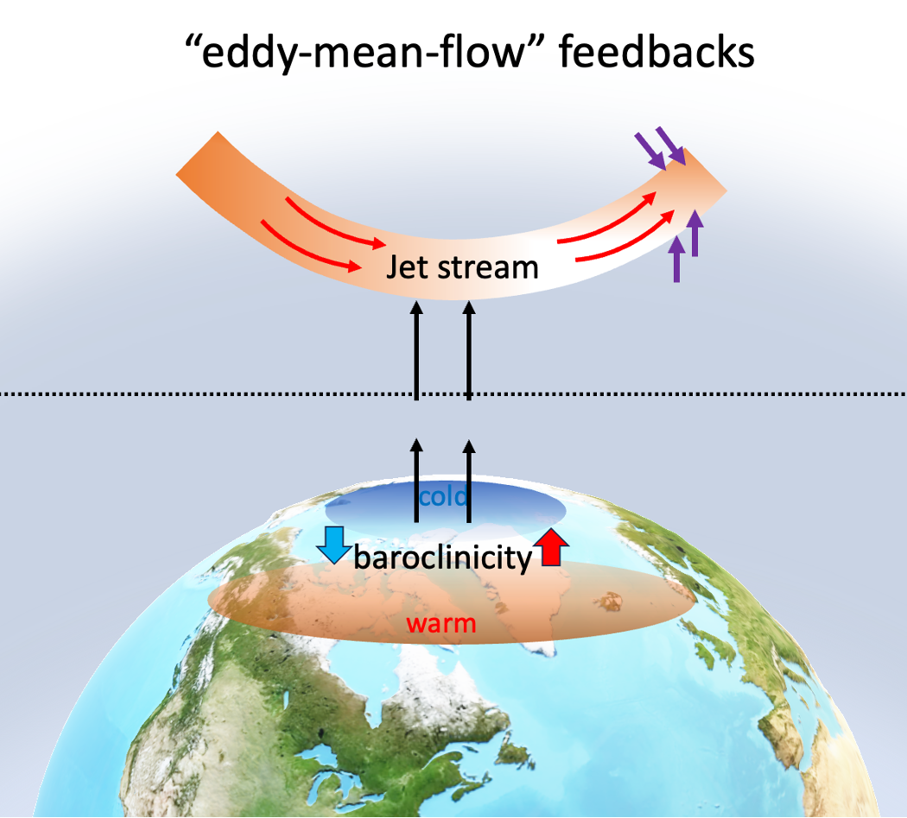

<p align="center">
  
</p>

# NAO eddy–mean-flow feedback

Code for the paper:

> **Strengthened eddy–mean-flow feedbacks increase summer North Atlantic Oscillation extremes**
> Quan Liu et al. (submitted)


## Repository layout

```
src/                           reusable modules: data readers, NAO index,
                               extremes, composites, dynamics, plotting
script/
├── 0preprocess/               CDO/SLURM: collect variables, daily
│                              anomalies, 2–12-day eddies, eddy fluxes
├── 1large_scale_flow/         PV on isentropes, θ on 2 PVU, wave breaking,
│                              Eady growth rate, EP flux, jet latitude
├── 2flow_NAO_composite/       composites around NAO extremes
├── 3flow_NAO_composite_alldec/
│                              baroclinicity, blocking, wave breaking,
│                              jet location composites (all decades)
├── 4posprocessing_plotting/   feedback statistics, export to CSV
└── 5plot/                     paper figures (main: numbered scripts 1–5)
test/                          pytest tests for extremes and composites
```

## Setup

```bash
conda env create -f environment.yml
conda activate air_sea
pytest test/
```

## Workflow

Scripts are meant to be run in order `0preprocess → 1 → 2/3 → 4 → 5plot`. Steps 0–3 are SLURM jobs written for DKRZ Levante (`*_master.sh` submits `*_submit.sh` / `*.py` per ensemble member or variable) and need CDO and GNU parallel. Step 5 scripts are `# %%` cell scripts that read the processed data and write PDFs.

| Script (`script/5plot/`)       | Content                                       |
| ------------------------------ | --------------------------------------------- |
| `1balance_composite_maps.py`   | Composite maps: momentum balance, wave breaking |
| `2eddy_mean_line_9040_ano.py`  | Eddy–mean-flow evolution around NAO extremes  |
| `3feedback_density.py`         | Joint PDF of the feedback                     |
| `4flux_feedback_decade.py`     | Feedback strength vs. decade                  |
| `5difference_latitude_*.py`    | Latitude / time differences, last10 − first10 |

Other scripts in `5plot/` produce supplementary figures.

## Data

- **MPI-GE CMIP6** (historical + SSP5-8.5, 50 members): available from ESGF / DKRZ.
- **ERA5**: Copernicus Climate Data Store.

Processed data are not included. Paths are hard-coded to `/work/mh0033/m300883/High_frequecy_flow/data/` and `/scratch/m/m300883/`; change them in `src/data_helper/` and the shell scripts before running elsewhere.

## Third-party code

`src/_aostools`, `src/_ConTrack` and `src/_blocking` are adapted from external packages (aostools, ConTrack); see their own licenses.

## License

MIT, see [LICENSE](LICENSE).
